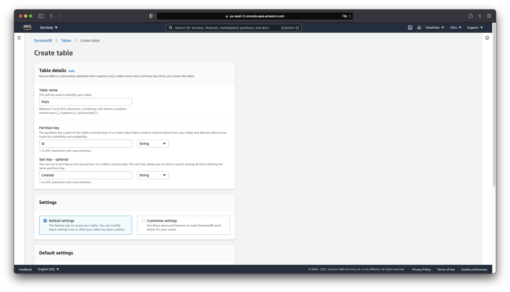

# Deploy an ASP.NET Core API to elastic beanstalk

This describes the steps to deploy the APIs to AWS Elastic Beanstalk.

## Requirements
* AWS Account
* Elastic Beanstalk instance
* .NET core 5.0 sdk
* Private ethereum network
* Ethereum account with sufficient funds

___

## Registry contract deployment
The solution proposed is composed of two contracts:
* **Registry:** This is the main contract that stores the information about the deployed poll contracts to the network, the users will also be managed here and this is related to the entity that governs over the  voting processes.
* **Poll:** this is each and every individual poll or voting process, the voting can be done here by the voters and the results can be obtained after it closes.

    Since all of the actions depend on a single registry instance, the registry contract is deployed to the network and the address is used in the projects to function properly.


1. Open VoteChain.API project with your favorite IDE or code editor, we are going to use VSCode, but you can use any other IDE.


2. open the file `InitialConfiguration/Program.cs`, we must update some variables here in order to deploy the Registry contract

    ```csharp
    const string ownerAccount = "{ACCOUNT_ADDRESS}";
    const string ownerPassword = "{ACCOUNT_PASSWORD}";
    const string nodeUrl = "{NODE_URL}";
    ```
    **ownerAccount:** Is the account created when deploying the private ethereum node.

    **ownerPassword:** Is the password used to create the owner account.

    **nodeUrl:** Url or IP address of the private node.

3. Open a new terminal instance and execute the command to run the project.

    ```shell
    dotnet run --project InitialConfiguration/InitialConfiguration.csproj
    ```
    

4. Save the `Registration contract address` because this will be used later in the deployment process.

## Create a DynamoDB instance

DynamoDB is a NoSQL database that is used to store the data of pre registered users, once the users complete the registration process, the data is stored in the registration contract. Polls are also being registered in the DynamoDB instance, but references to this can be removed, since the interaction with polls is fully being doen using the `Registration Contract`.
To be able to execute the registration of users, we need to create a DynamoDB instance, following the steps below.

1. In your AWS console panel, look for the DynamoDB service.


2. Go to the `Tables` section and click on the `Create table` button.


3. Fill the form for the `Polls`and once again for the `Voters` tables, settings the name individually and leaving the values for `Partition Key` as `Id (string)` and `Sort Key` as `Created (string)` for both tables, leave the rest as is, and click on the `Create table` button.


4. Now we need to create a user to access the recently created tables, so on the services search input, search for `IAM User` and then on the `Access management > users` menu item.

5. Click on the Àdd users` button and fill the form, making sure the `Access key - Programmatic access` checkbox is checked.


6. In the permissions section, click on the `Attach existing policies directly` and look for the `AmazonDynamoDBFullAccess` policy (Not recommended for production environments, please adjust accordingly).


7. The tags can be left blank, and you can click on the `Next: Review` button and then the `Create user` button, make sure you securely store the user's `Access Key ID` and `Secret access key`, since we are going to use these in the APIs environment configuration.


## APIs environment variables configuration

1. In the root of the `VoteChain.API.Admin` project, create a new file `appsettings.Production.json` and set the contents of the file as follows (setting up your own information):

    ```json
    {
        "Eth": {
            "Url": "{ETHEREUM_NODE_URL}",
            "OwnerAccount": "{OWNER_ACCOUNT}",
            "OwnerPassword": "{OWNER_ACCOUNT_PASSWORD}",
            "MinEthBalance": 2,
            "RegistrationContractAddress": "{REGISTRATION_CONTRACT_ADDRESS}"
        },
        "AmazonWebServices": {
            "DynamoDB": {
                "AccessKey": "{IAM_USER_ACCESS_KEY}",
                "SecretKey": "{IAM_USER_SECRET_KEY}"
            }
        },
        "Email": {
            "Port": "{SMTP_SERVER_PORT}",
            "Password": "{EMAIL_ACCOUNT_PASSWORD}",
            "Address": "{EMAIL_ADDRESS}",
            "Host": "{SMTP_SERVER_DOMAIN}",
            "EnableSsl": {SMTP_SERVER_ENABLE_SSL} // true or false
        }
    }
    ```

2. Add a new file `appsettings.Production.json` with the same contents of the previews one in the root of the `VoteChain.API.Voter` project.

3. Now that we have the environment configuration in the `appsettings.Production.json` file, we can proceed to build the artifact for a later deployment, to do so, we need to run the commands:
    ```shell
    dotnet publish VoteChain.API.Admin/VoteChain.API.Admin.csproj -c Release -o AdminRelease
    dotnet publish VoteChain.API.Voter/VoteChain.API.Voter.csproj -c Release -o VotersRelease
    ```
    

4. Once both folders `AdminRelease` and `VotersRelease` are created, go to each folder and compress all the files into a zip file (This is the file we'll deploy to the AWS Elastic Beanstalk instance).

## Deploy the APIs to AWS Elastic Beanstalk

1. In the AWS console panel, look for the Elastic Beanstalk service, and form there click on the `Create Application` button.

2. Fill the form with the following information:

    * Application name: `Admin.API`
    * Platform: `.NET Core on Linux`
    * Platform branch: `.NET Core running on 64bit Amazon Linux 2`
    * Platform version: `2.2.7 (Recommended)`
    * Application code: `Upload your code`
    * Version label: `{VERSION}`
    * Local file: `AdminRelease/AdminRelease.zip`

3. Click on the `Create application` button.


4. Do the same thing for the `Voters.API` project, and upload the `VotersRelease/VotersRelease.zip` file.

