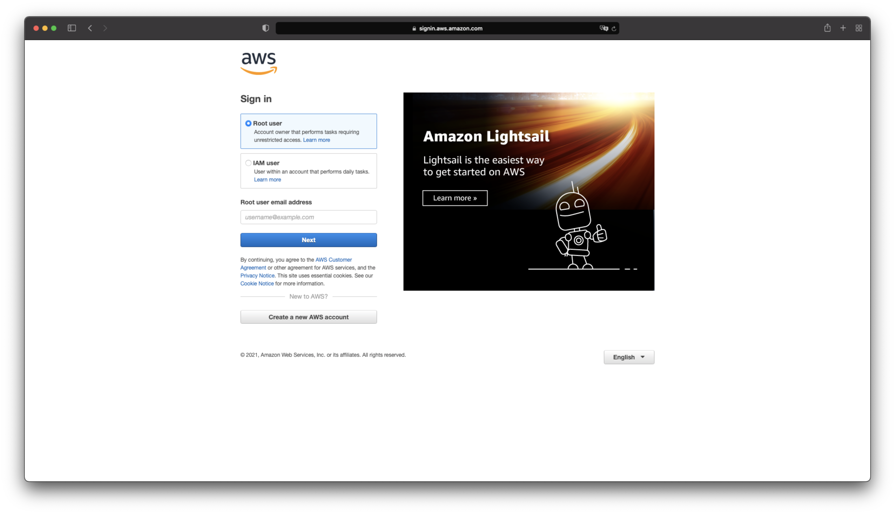
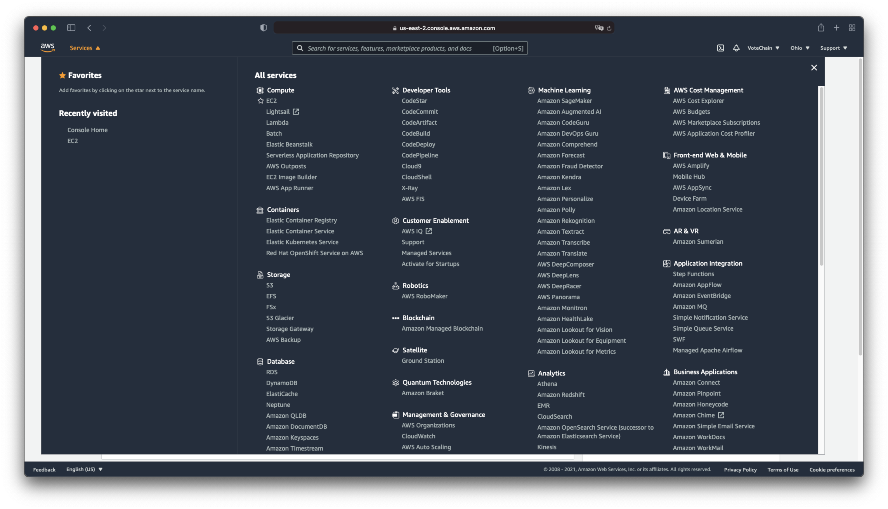
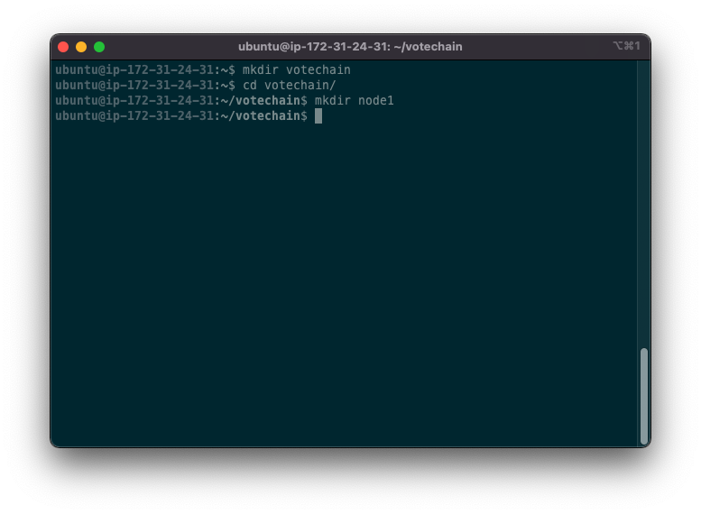

# Create a private Ethereum network in AWS

## Requirements
* AWS Account
* AWS EC2 instance
* Private key to connect to the instance
* SSH client

___

## Create the EC2 Instance
1. Go to [https://console.aws.amazon.com](https://console.aws.amazon.com) and log in with your credentials
    
2. From the services tab click on `EC2`, under the `compute` section
    
3. Click on the launch instance button
    
4. Select the `Ubuntu Server 20.04 LTS (HVM), SSD Volume Type` machine image
    
5. Select the hardware configuration of the Virtual Machine. (For development purposes, we will be selecting a `t2.medium` instance configuration)
    
6. Click on the `Review and launch` button
    
7. Click on the `Launch` button
    > **Note:** A message is shown about security, this part doesn't pertain to the basic deployment of the instance, so it will be left out, but have to be taken into consideration for production environments
8. Select a key pair from your existing ones or create a new one, download it and keep it in a safe place, because you won't be able to download it later
    
9. When the process is completed, we will be taken to the EC2 instances list, where the recently created one will be shown and from here we can check the details to the instance
    
10. We can enable access to the instance from the internet at this point, or do it later when the other applications are deployed so that we know exactly which IPs are going to make requests to our network. For convinience, we are goint to enable access now to every IP and trough any port so click on the instance ID and then on the `Security` tab, to finally click on the security group id
    
11. Once in the security group, click on the `Edit inbound rules` button
    
12. Add a new rule to allow access to the geth instance, we will be using the `All TCP` type from the dropdown menu, and enable all the clients using the `0.0.0.0/0` IP range and finally click on the `Save rules` button.
    

    > **Note:** On a production environment it is not recommended to enable access to the public IPs and to all ports, so we'd advise you to come back later and enable access to the public IPs and to the ports you need.

## Assign an static IP to the EC2 machine
An static IP must be created in order to avoid it changing when the instance stops, this will help reduce errors later on with the integration

1. Go to the `Elastic IPs` page, this is found on the lateral menu, under the **Network & Security** section
    
2. Click the `Allocate Elastic Ip address` button
    
3. Leave everything as is and click on the `Allocate` button
    
4. Once the public IP has been allocated successfully, click on the associate button and complete the association to the recently created ubutnu instance, save it to use it moving forward
    

## Install Go-Ethereum
We are going to use Go Ethereum (Geth), which is the official Go implementation of the ethereum protocol, this software is fully open source, released under the GNU LGPL v3 license.

1. Connect to the recently created machine using SSH

    ```shell
    ssh -i "key.pem" ec2-user@{INSTANCE_PUBLIC_DNS}
    ```

    

    > **Note:** If the connection doesn't work, make sure the key file has the proper permissions (400) with the command:

    ```shell
    chmod 400 key.pem
    ```

2. Once connected to the machine via SSH, we will need to install geth by running the following commands
    ```shell
    sudo apt-get install software-properties-common
    sudo add-apt-repository -y ppa:ethereum/ethereum
    sudo apt-get update
    sudo apt-get install ethereum
    ```
    > **Note:** Installation instructions for Go Ethereum can be also found in their website: [Installing Geth | Go Ethereum](https://geth.ethereum.org/docs/install-and-build/installing-geth)

3. After running the commands, you can check if geth i installing by running the command 
    ```
    geth --help
    ```
    

## Setting up the node
To create a private ethereum node, we will have to make use of a `genesis file`, which is a *json* configuration file that help the software determine how to handle things like an initial account ether, mining difficulty, and so on.

1. Create a folder that will contain the nodes and the node folders (just one for demo purposes)

    ```shell
    mkdir votechain
    cd votechain
    mkdir node1
    ```
    

2. Create an owner account for the node (Save the account address for later use).
    ```shell
    geth --datadir node1/ account new
    ```
    

3. Create a password.txt file with the password for the accountto be used later on
    ```
    echo '{ACCOUNT_PASSWORD}' > node1/password.txt
    ```

4. Use Go Ethereum's tool `puppeth` to generate a genesis file for the node.
    ```shell
    puppeth
    ```
    * `Please specify a network name to administer` set a network name
    * Select `Configure new genesis`
    * Select `Create new genesis from scratch`
    * Select `Clique - proof-of-authority`
    * `How many seconds should blocks take?` Set 1 second block time
    * `Which accounts are allowed to seal?` Add the account created in the previous step
    * `Which accounts should be pre-funded?` Add the account once again
    * `Should the precompile-addresses (0x1 .. 0xff) be pre-funded with 1 wei?` yes
    * `Specify your chain/network ID if you want an explicit one` Set an network id
    

5. Export genesis configuration into a file
    * Select `Manage existing genesis`
    * Select `Export genesis configurations`
    * `Which folder to save the genesis specs into?` Hit enter so that the file is created in the current folder
    * Close the puppeth tool
    

6. Modify the genesis file, look for the `clique` node and update the period to make it so that geth only creates a new block when there's a new transaction in the network
    ```json
    "clique": {
        "period": 0,
        "epoch": 30000
    } 
    ```

7. Copy the file to a new one called `genesis.json`
    ```shell
    cp 1987.json genesis.json
    ```

8. Initialize the node using the recently created genesis file
geth --datadir node1/ init genesis.json
    

9. Run the node
    ```shell
    geth --datadir=$pwd --syncmode 'full' --port 30310 --miner.gasprice 0 --miner.gastarget 470000000000 --http --http.addr 0.0.0.0 --http.port 8545 --http.api admin,eth,debug,miner,net,txpool,personal,web3 --http.corsdomain '*' --mine --allow-insecure-unlock --unlock {ACCOUNT_ADDRESS} --password password.txt
    ```

    * **--identity:** Name of the node (as it will appear on the chain).
    * **--http.corsdomain:** Domains separated by commas allowed to make cross browser requests. A wildcard `*` can be used to allow all clients.
    * **--nodiscover:** Determines ifthe network should be discovered by other random nodes.
    * **--port:** Used by other nodes to connect manually to the network.
    * **--networkid:** This should be something unique from other networks, but will be the same among all the nodes within the network.

    for more information on geth parameters, please check the official documentation [Command-line Options | Go Ethereum](https://geth.ethereum.org/docs/interface/command-line-options)